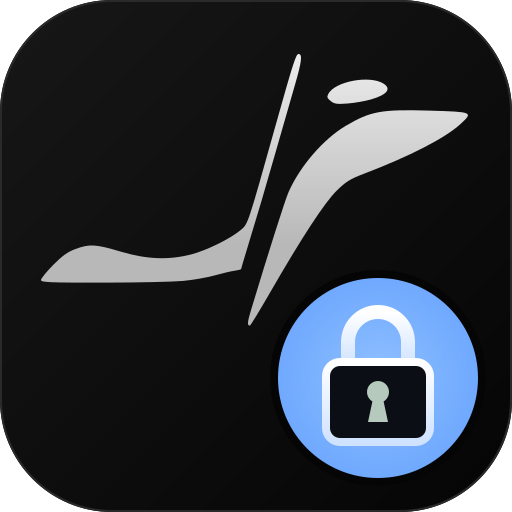

# Secrets Saver for Orca



Your projects' configuration files and a personal vault in Orca's sidebar.

> **Unofficial Orca modification.** This project replaces the installed `app.asar` to enable communication between the panel and the worker. It is not a standalone plugin for the Orca catalog and is not affiliated with the Orca team. Installation creates a backup; Orca updates may remove the patch or make it incompatible. The package contains this project's code and scripts, without Orca binaries.

## Features

- **Local:** lists files recognized by name, such as `.env`, `.env.production`, and conventional configuration files, in projects open in Orca. View, copy, and edit their contents. Saving changes updates the actual project file.
- **Vaulted:** a personal list of secrets, independent of repositories, with no project selector. Add, reveal, edit, copy, and delete entries. Uses Orca's encrypted storage and the operating system's keyring.

The plugin requires trust: its worker reads local files and uses Orca's internal APIs. It does not provide cloud sync or a separate master password.

## Requirements

- **Linux**, with Orca installed. Developed against Orca **1.4.205**; compatibility with other versions depends on their internal files.
- **Node.js 22.12 or later**, npm, Bash, and `sudo` access to replace the installed archive.
- A Secret Service compatible keyring, such as GNOME Keyring, running and unlocked in your desktop session.
- Internet access to install npm dependencies. This project does not yet include installers for macOS or Windows.

## Installation

1. Download and extract the [v0.1.3 release package](https://github.com/Christopher-Moreira/orca-secrets-saver/releases/download/v0.1.3/secrets-saver-0.1.3.tar.gz). You can also select **Code → Download ZIP** in the [repository](https://github.com/Christopher-Moreira/orca-secrets-saver), or clone it:

   ```bash
   git clone https://github.com/Christopher-Moreira/orca-secrets-saver.git
   cd orca-secrets-saver
   ```

2. Save your work and close Orca. Open an external terminal in the project directory.
3. Run **without sudo**:

   ```bash
   bash install.sh
   ```

   The installer builds the plugin and prepares a patch from your current Orca installation. Only the application step requests sudo. It checks the files before replacing `app.asar`, preserves a backup, and configures your desktop shortcut to launch with `--password-store=gnome-libsecret`.

4. Open Orca. In **Settings → Plugins**, enable development plugins, add the absolute path shown by the installer (`orca-plugin/dist`), and approve the **Secrets Saver** permissions: `secrets`, `storage`, and `workspace:read`.
5. Open **Secrets** in the sidebar. Keep the installed directory in place: Orca loads the plugin from it.

If Orca is installed elsewhere:

```bash
ORCA_RES=/path/to/orca/resources bash install.sh
```

To prepare the files without modifying your installation:

```bash
bash install.sh --prepare
```

## Language

The `followOrcaLanguage` flag is enabled by default in `orca-plugin/settings.json`:

```json
{
  "followOrcaLanguage": true,
  "language": "en"
}
```

The panel follows Orca's `settings.uiLanguage`. When Orca uses `system`, it follows the locale reported by the system environment. The panel supports Portuguese, English, and Spanish; other languages fall back to English. The **Local** and **Vaulted** tab names stay the same. Some technical worker diagnostics still appear in Portuguese.

To select a fixed language, set `followOrcaLanguage` to `false` and `language` to `pt`, `en`, or `es`. Then run:

```bash
npm run build --prefix orca-plugin
```

Reload the plugin or restart Orca. Changing the language does not require reapplying the patch.

## Updating and uninstalling

After updating Orca, close it and run `bash install.sh` again. The installer uses the currently installed version as the patch source. If the expected internal code locations have changed, preparation stops and leaves the installation intact.

To restore the original `app.asar`, close Orca and run:

```bash
bash install.sh --uninstall
```

Then remove the plugin's development path in **Settings → Plugins**. Your vault and local files are preserved. The desktop shortcut also keeps its libsecret setting so it can continue accessing the same keyring. If you previously had a custom shortcut, its backup is stored at `~/.local/share/applications/stably-orca.desktop.secrets-saver-bak`.

Restoration rejects a backup if Orca has been updated since the patch was applied. Older installations without recovery metadata must have the patch reapplied using the new installer before using this uninstall command.

## Building a distribution package

```bash
npm ci --prefix orca-plugin
node scripts/package.mjs
```

The files `release/secrets-saver-0.1.3.tar.gz` and `.tar.gz.sha256` can be attached to a GitHub release. The package includes the compiled plugin, source code, and installer. It excludes `app.asar`, backups, profiles, secrets, and `node_modules`. To verify integrity, run this in the download directory:

```bash
sha256sum -c secrets-saver-0.1.3.tar.gz.sha256
```

## Troubleshooting

- **`action: not a panel-callable action`:** the patch is missing. Close Orca and run the installer again.
- **Encryption unavailable:** unlock your desktop session's keyring and launch Orca using the configured shortcut or `stably-orca --password-store=gnome-libsecret`.
- **Local is empty:** open a project in Orca. Discovery depends on internal profile state, supported filenames, and scanner limits; it does not display arbitrary files.
- **Missing or ambiguous patch anchor:** the patch needs to be adapted for this Orca version. Do not manually apply an archive prepared for a different version.

See [install/README.md](install/README.md) for integration details (in Portuguese).
